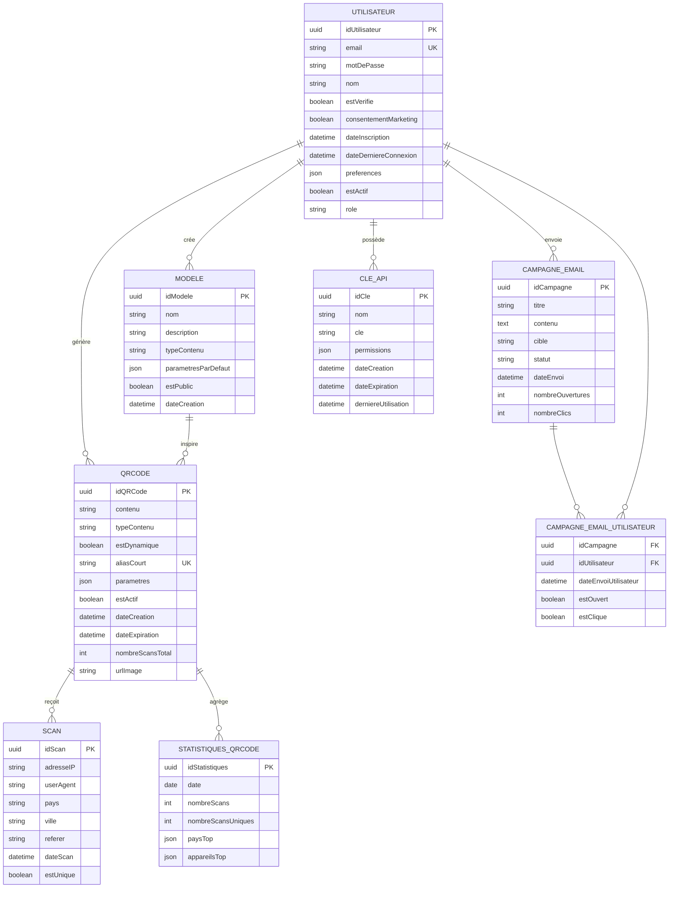

# MCD — Modèle Conceptuel de Données

## Contexte

SaaS gratuit de génération de QR codes. L'inscription est obligatoire afin de pouvoir envoyer des campagnes emails automatisées.  
Stack cible : React + Vite (frontend), Wrangler / Cloudflare Workers (backend), MongoDB (base de données), Nodemailer + SMTP maison (emails).

---

## Entités et attributs

### UTILISATEUR

| Attribut | Type | Description |
|----------|------|-------------|
| idUtilisateur | Identifiant | UUID technique, clé primaire |
| email | Chaîne | Email unique, utilisé pour l'authentification et le marketing |
| motDePasse | Chaîne | Hash bcrypt du mot de passe |
| nom | Chaîne | Nom d'affichage de l'utilisateur |
| estVerifie | Booléen | Email confirmé via token |
| consentementMarketing | Booléen | Accepte de recevoir les campagnes emails |
| dateInscription | DateTime | Date de création du compte |
| dateDerniereConnexion | DateTime | Dernière connexion enregistrée |
| preferences | JSON | Préférences UI, langue, notifications |
| estActif | Booléen | Compte actif ou désactivé |
| role | Enumérateur | `utilisateur`, `admin` |

### QRCODE

| Attribut | Type | Description |
|----------|------|-------------|
| idQRCode | Identifiant | UUID technique, clé primaire |
| contenu | Chaîne | Données encodées dans le QR (URL, texte, etc.) |
| typeContenu | Enumérateur | `url`, `texte`, `email`, `telephone`, `sms`, `wifi`, `vcard`, `geo`, `pdf` |
| estDynamique | Booléen | Si vrai, le contenu peut être redirigé/modifié sans réimprimer le QR |
| aliasCourt | Chaîne | Slug unique pour les QR dynamiques (ex: `q/abc123`) |
| parametres | JSON | Taille, couleur, correction d'erreur, logo, cadre |
| estActif | Booléen | QR actif ou désactivé |
| dateCreation | DateTime | Date de génération |
| dateExpiration | DateTime | Optionnelle, date de péremption |
| nombreScansTotal | Entier | Compteur agrégé de scans |
| urlImage | Chaîne | Chemin du fichier PNG/SVG généré |

### SCAN

| Attribut | Type | Description |
|----------|------|-------------|
| idScan | Identifiant | UUID technique, clé primaire |
| adresseIP | Chaîne | IP anonymisée (dernier octet masqué) |
| userAgent | Chaîne | Navigateur / appareil du scanneur |
| pays | Chaîne | Pays déduit de l'IP |
| ville | Chaîne | Ville déduite de l'IP |
| referer | Chaîne | Site référant, si disponible |
| dateScan | DateTime | Horodatage du scan |
| estUnique | Booléen | Premier scan pour cette IP sur ce QR aujourd'hui |

### MODELE

| Attribut | Type | Description |
|----------|------|-------------|
| idModele | Identifiant | UUID technique, clé primaire |
| nom | Chaîne | Nom du modèle |
| description | Chaîne | Description optionnelle |
| typeContenu | Enumérateur | Type de QR supporté par le modèle |
| parametresParDefaut | JSON | Configuration graphique par défaut |
| estPublic | Booléen | Visible par tous les utilisateurs |
| dateCreation | DateTime | Date de création |

### CAMPAGNE_EMAIL

| Attribut | Type | Description |
|----------|------|-------------|
| idCampagne | Identifiant | UUID technique, clé primaire |
| titre | Chaîne | Sujet de l'email |
| contenu | Texte | Corps HTML/texte de la campagne |
| cible | Enumérateur | `tous`, `actifs`, `inactifs`, `non_verifies` |
| statut | Enumérateur | `brouillon`, `programmee`, `envoyee`, `annulee` |
| dateEnvoi | DateTime | Date d'envoi programmé ou réel |
| nombreOuvertures | Entier | Nombre total d'ouvertures |
| nombreClics | Entier | Nombre total de clics |

### STATISTIQUES_QRCODE

| Attribut | Type | Description |
|----------|------|-------------|
| idStatistiques | Identifiant | UUID technique, clé primaire |
| date | Date | Jour concerné |
| nombreScans | Entier | Nombre de scans ce jour |
| nombreScansUniques | Entier | Scans uniques ce jour |
| paysTop | JSON | Top 5 des pays des scanneurs |
| appareilsTop | JSON | Top 5 des familles d'appareils |

### CLE_API

| Attribut | Type | Description |
|----------|------|-------------|
| idCle | Identifiant | UUID technique, clé primaire |
| nom | Chaîne | Libellé de la clé (ex: "Intégration site") |
| cle | Chaîne | Token JWT ou chaîne aléatoire fort |
| permissions | JSON | Liste des scopes autorisés |
| dateCreation | DateTime | Date de création |
| dateExpiration | DateTime | Date d'expiration optionnelle |
| derniereUtilisation | DateTime | Dernière utilisation |

---

## Associations et cardinalités

```text
UTILISATEUR (1,1) -- génère -- (0,n) QRCODE
    Règle : chaque QR code appartient à un et un seul utilisateur inscrit.

UTILISATEUR (0,1) -- crée -- (0,n) MODELE
    Règle : un modèle a éventuellement un créateur ; un utilisateur peut créer plusieurs modèles.

UTILISATEUR (1,1) -- possède -- (0,n) CLE_API
    Règle : une clé API appartient à un seul utilisateur.

UTILISATEUR (1,1) -- envoie -- (0,n) CAMPAGNE_EMAIL
    Règle : une campagne est créée par un administrateur/utilisateur autorisé.

CAMPAGNE_EMAIL (1,n) -- cible -- (0,n) UTILISATEUR
    Association portée : dateEnvoiUtilisateur, estOuvert, estClique.

QRCODE (1,1) -- reçoit -- (0,n) SCAN
    Règle : un scan concerne un et un seul QR code.

QRCODE (1,1) -- agrège -- (0,n) STATISTIQUES_QRCODE
    Règle : les statistiques journalières sont regroupées par QR code.

MODELE (0,1) -- inspire -- (0,n) QRCODE
    Règle : un QR code peut être créé à partir d'un modèle.
```

---

## Diagramme MCD (Mermaid)



---

## Règles de gestion (RG)

| Code | Règle |
|------|-------|
| RG01 | Un utilisateur doit posséder un email unique et confirmé pour accéder aux fonctionnalités de génération. |
| RG02 | Chaque QR code appartient obligatoirement à un compte utilisateur inscrit. |
| RG03 | Le contenu brut d'un QR code statique est immuable après sa création. |
| RG04 | Le contenu d'un QR code dynamique peut être modifié sans changer l'image imprimée. |
| RG05 | Chaque scan est horodaté et anonymisé (IP partiellement masquée). |
| RG06 | Un utilisateur peut activer ou désactiver ses propres QR codes. |
| RG07 | Un modèle public peut être utilisé par n'importe quel utilisateur inscrit. |
| RG08 | Une campagne email ne cible que les utilisateurs ayant explicitement consenti au marketing. |
| RG09 | Les statistiques sont agrégées quotidiennement par QR code. |
| RG10 | Une clé API expire automatiquement si une date d'expiration est définie et dépassée. |

---

## Contraintes d'intégrité fonctionnelle (CIF)

| Code | Contrainte |
|------|------------|
| CIF01 | Si `estActif = vrai` alors `estVerifie = vrai`. |
| CIF02 | Si `estDynamique = vrai` alors `aliasCourt` est renseigné et unique. |
| CIF03 | Si `dateExpiration` est renseignée alors `dateExpiration > dateCreation`. |
| CIF04 | Si un scan est enregistré alors le QR code associé existe et est actif. |
| CIF05 | Si `statut = envoyee` alors `dateEnvoi <= maintenant`. |
| CIF06 | Si `consentementMarketing = faux` alors l'utilisateur ne peut être ciblé par une campagne. |

---

## Dictionnaire des données

| Entité | Attribut | Type conceptuel | Type MongoDB | Obligatoire | Remarque |
|--------|----------|---------------|--------------|-------------|----------|
| UTILISATEUR | idUtilisateur | Identifiant | ObjectId / UUID | Oui | Généré automatiquement |
| UTILISATEUR | email | Chaîne | String | Oui | Unique, indexé |
| UTILISATEUR | motDePasse | Chaîne | String | Oui | Hash bcrypt |
| QRCODE | contenu | Chaîne | String | Oui | Données encodées |
| QRCODE | typeContenu | Enumérateur | String | Oui | Valeur contrôlée |
| QRCODE | estDynamique | Booléen | Boolean | Oui | Défaut false |
| QRCODE | aliasCourt | Chaîne | String | Non | Unique si renseigné |
| SCAN | adresseIP | Chaîne | String | Non | Dernier octet masqué |
| SCAN | estUnique | Booléen | Boolean | Oui | Calculé à l'insertion |
| CAMPAGNE_EMAIL | cible | Enumérateur | String | Oui | Filtre d'audience |
| CLE_API | cle | Chaîne | String | Oui | Chiffrée au repos |

---

## Hypothèses et options de modélisation

1. **QR anonyme vs inscrit** : L'inscription obligatoire implique qu'un QR code est toujours rattaché à un utilisateur. Aucun QR anonyme n'est autorisé.
2. **QR statique vs dynamique** : Un QR statique encode directement les données. Un QR dynamique encode une URL intermédiaire (`q/abc123`) qui redirige vers `contenu` ; ce dernier est modifiable.
3. **Statistiques dénormalisées** : `nombreScansTotal` sur `QRCODE` est une vue agrégée de `STATISTIQUES_QRCODE.nombreScans` pour accélérer la lecture ; il doit être recalculé périodiquement.
4. **RGPD / consentement** : `consentementMarketing` est stocké explicitement et horodaté ; il est modifiable par l'utilisateur.
