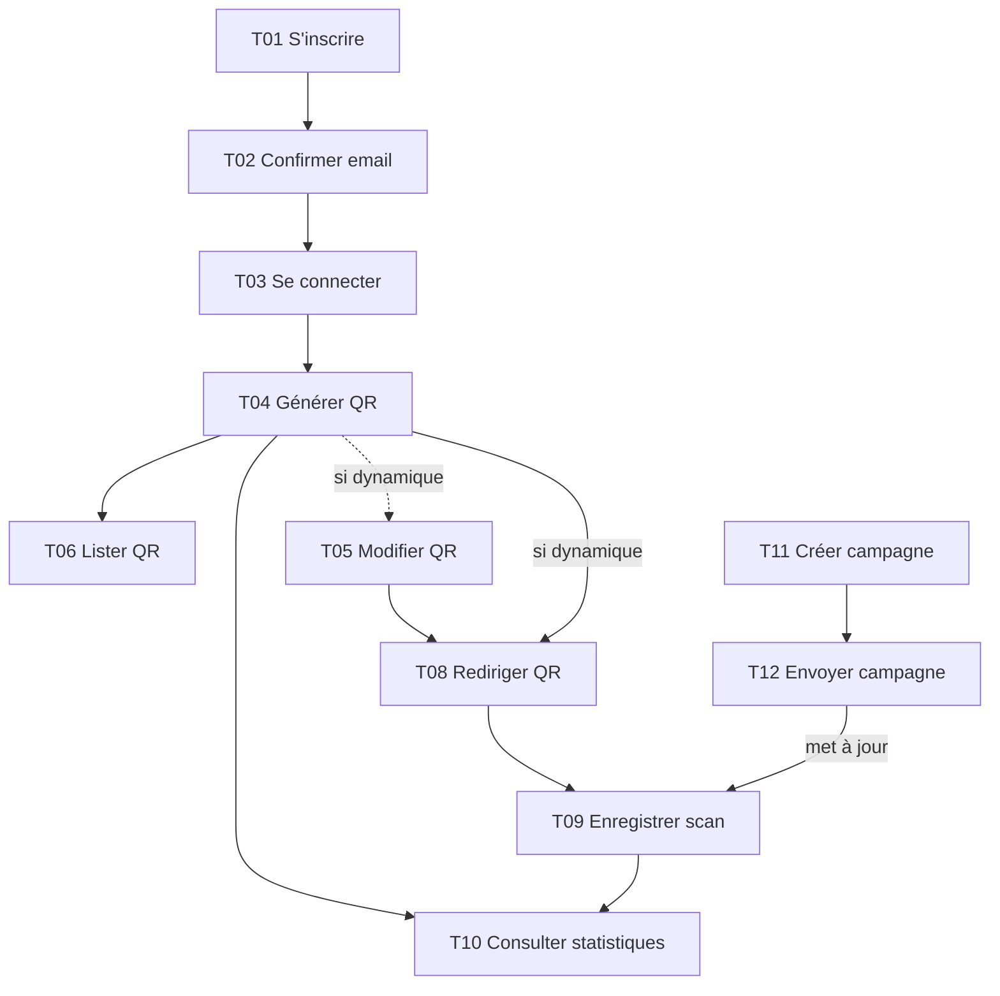
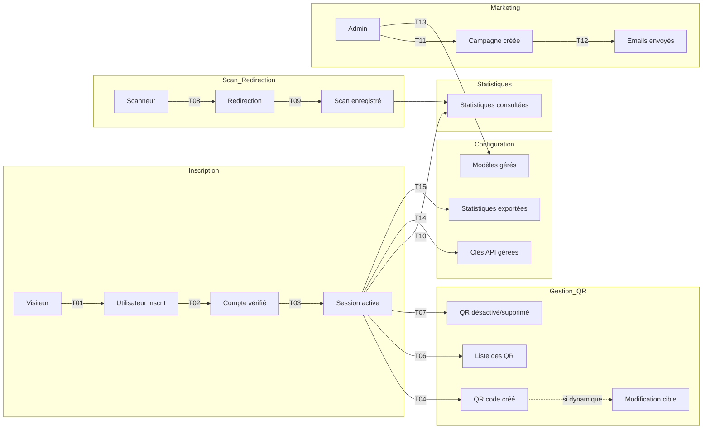

# MCT — Modèle Conceptuel de Traitements

## Contexte

Traitements métier du SaaS QR code. Ce document décrit les traitements fonctionnels, leurs déclencheurs, leurs opérations et les acteurs concernés. La modélisation s'appuie sur MERISE 2.0.

---

## Liste des traitements

| Code | Nom du traitement | Acteur principal | Type |
|------|-------------------|------------------|------|
| T01 | S'inscrire | Visiteur | Métier |
| T02 | Confirmer son email | Utilisateur | Métier |
| T03 | Se connecter | Utilisateur | Métier |
| T16 | Rafraîchir un access token | Utilisateur | Technique |
| T17 | Révoquer une session | Utilisateur | Métier |
| T04 | Générer un QR code | Utilisateur | Métier |
| T05 | Modifier un QR code dynamique | Utilisateur | Métier |
| T06 | Lister ses QR codes | Utilisateur | Métier |
| T07 | Désactiver / supprimer un QR code | Utilisateur | Métier |
| T08 | Rediriger un QR code dynamique | Système | Technique |
| T09 | Enregistrer un scan | Système | Technique |
| T10 | Consulter les statistiques d'un QR code | Utilisateur | Métier |
| T11 | Créer une campagne email | Administrateur | Métier |
| T12 | Programmer / envoyer une campagne email | Système | Technique |
| T18 | Enregistrer un événement de tracking email | Système | Technique |
| T13 | Gérer les modèles de QR | Administrateur | Métier |
| T14 | Gérer les clés API | Utilisateur | Métier |
| T15 | Exporter les statistiques | Utilisateur | Métier |

---

## Traitement T01 — S'inscrire

| Élément | Description |
|---------|-------------|
| Déclencheur | Le visiteur soumet le formulaire d'inscription. |
| Acteur | Visiteur |
| Données en entrée | email, motDePasse, nom, consentementMarketing |
| Données en sortie | Compte utilisateur créé (statut `estVerifie = false`), email de confirmation envoyé. |
| Pré-conditions | L'email n'existe pas déjà en base. Le mot de passe respecte la politique de sécurité. |
| Post-conditions | L'utilisateur est enregistré avec `role = utilisateur` et `estActif = true`. Un token de vérification est généré. |

### Opérations

1. Valider le format de l'email et la force du mot de passe.
2. Vérifier l'unicité de l'email.
3. Hasher le mot de passe avec bcrypt.
4. Insérer le document dans `utilisateurs`.
5. Générer un token de vérification d'email unique, stocker son hash dans `tokens_email`.
6. Envoyer un email de confirmation via Nodemailer + SMTP maison.
7. Retourner une réponse anonymisée (sans hash mot de passe).

### Règles de gestion associées

- RG01 (inscription obligatoire)
- RG08 (consentement marketing explicite)

---

## Traitement T02 — Confirmer son email

| Élément | Description |
|---------|-------------|
| Déclencheur | L'utilisateur clique sur le lien de confirmation reçu par email. |
| Acteur | Utilisateur |
| Données en entrée | token de vérification |
| Données en sortie | Compte marqué comme vérifié. |
| Pré-conditions | Le token est valide, non expiré, et correspond à un utilisateur existant non vérifié. |
| Post-conditions | `estVerifie = true`. Le token est marqué comme utilisé. |

### Opérations

1. Hasher le token brut et le rechercher dans `tokens_email`.
2. Vérifier le type, la non-utilisation et la non-expiration.
3. Rechercher l'utilisateur correspondant.
4. Mettre à jour `estVerifie` à `true`.
5. Marquer le token comme utilisé avec la date d'utilisation.
6. Rediriger l'utilisateur vers le tableau de bord.

---

## Traitement T03 — Se connecter

| Élément | Description |
|---------|-------------|
| Déclencheur | L'utilisateur soumet ses identifiants. |
| Acteur | Utilisateur |
| Données en entrée | email, motDePasse |
| Données en sortie | Access token JWT + refresh token. |
| Pré-conditions | Le compte existe, est actif, et l'email est vérifié. |
| Post-conditions | `dateDerniereConnexion` mise à jour. Le refresh token est stocké (cookie httpOnly ou base). |

### Opérations

1. Rechercher l'utilisateur par email.
2. Comparer le mot de passe avec bcrypt.
3. Vérifier que `estVerifie` et `estActif` sont vrais.
4. Générer un access token JWT (15 min) et un refresh token opaque (7 jours).
5. Hasher le refresh token et l'enregistrer dans `refresh_tokens` avec IP et userAgent.
6. Mettre à jour `dateDerniereConnexion`.
7. Retourner les tokens.

---

## Traitement T04 — Générer un QR code

| Élément | Description |
|---------|-------------|
| Déclencheur | L'utilisateur valide le formulaire de création. |
| Acteur | Utilisateur |
| Données en entrée | contenu, typeContenu, parametres (taille, couleurs, logo, etc.), option `estDynamique`. |
| Données en sortie | Document QR code créé + URL de l'image générée. |
| Pré-conditions | L'utilisateur est authentifié. Le contenu est valide selon le type choisi. |
| Post-conditions | Le QR code est persisté. L'image est stockée sur R2. |

### Opérations

1. Valider le contenu selon le type (URL bien formée, email valide, vCard cohérente, etc.).
2. Si `estDynamique = true`, générer un alias court unique.
3. Construire l'URL finale encodée : directe si statique, intermédiaire si dynamique.
4. Générer l'image PNG/SVG via une librairie QR côté backend (ex: `qrcode`).
5. Uploader l'image vers R2.
6. Insérer le document dans `qrcodes`.
7. Retourner le QR code et l'URL de l'image.

### Règles de gestion associées

- RG03 (QR statique immuable)
- RG04 (QR dynamique modifiable)
- RG06 (activation/désactivation par l'utilisateur)

---

## Traitement T05 — Modifier un QR code dynamique

| Élément | Description |
|---------|-------------|
| Déclencheur | L'utilisateur modifie la cible d'un QR dynamique. |
| Acteur | Utilisateur propriétaire |
| Données en entrée | idQRCode, nouveau contenu |
| Données en sortie | QR mis à jour. |
| Pré-conditions | Le QR existe, est dynamique, appartient à l'utilisateur, et est actif. |
| Post-conditions | Le champ `contenu` est mis à jour. L'image imprimée reste valide. |

### Opérations

1. Vérifier l'appartenance du QR à l'utilisateur.
2. Vérifier que `estDynamique = true`.
3. Valider le nouveau contenu.
4. Mettre à jour le champ `contenu`.
5. Journaliser la modification.

---

## Traitement T06 — Lister ses QR codes

| Élément | Description |
|---------|-------------|
| Déclencheur | L'utilisateur accède à son tableau de bord. |
| Acteur | Utilisateur |
| Données en entrée | Filtres optionnels (type, statut, recherche textuelle), pagination. |
| Données en sortie | Liste paginée de QR codes avec métriques rapides. |
| Pré-conditions | Utilisateur authentifié. |
| Post-conditions | Aucune modification. |

### Opérations

1. Récupérer l'identifiant de l'utilisateur depuis le token JWT.
2. Construire le filtre `idUtilisateur = ...` avec les filtres optionnels.
3. Exécuter une requête paginée sur `qrcodes`.
4. Joindre éventuellement les statistiques agrégées.
5. Retourner les résultats paginés.

---

## Traitement T07 — Désactiver / supprimer un QR code

| Élément | Description |
|---------|-------------|
| Déclencheur | L'utilisateur clique sur "Supprimer" ou "Désactiver". |
| Acteur | Utilisateur propriétaire |
| Données en entrée | idQRCode |
| Données en sortie | Confirmation de l'opération. |
| Pré-conditions | Le QR appartient à l'utilisateur. |
| Post-conditions | `estActif = false` (désactivation) ou suppression physique (soft-delete recommandé). |

### Opérations

1. Vérifier l'appartenance.
2. Désactiver (`estActif = false`) ou supprimer le document.
3. Supprimer l'image sur R2 si suppression physique.
4. Invalider le cache CDN éventuel.

---

## Traitement T08 — Rediriger un QR code dynamique

| Élément | Description |
|---------|-------------|
| Déclencheur | Requête HTTP GET sur `/{aliasCourt}`. |
| Acteur | Système |
| Données en entrée | aliasCourt, headers du navigateur. |
| Données en sortie | Redirection HTTP 302 vers le contenu final ou page 404. |
| Pré-conditions | Le QR dynamique existe et est actif. |
| Post-conditions | Le scan est enregistré de manière asynchrone (T09). |

### Opérations

1. Rechercher le QR par `aliasCourt`.
2. Vérifier `estActif = true` et non expiré.
3. Retourner une redirection 302 vers `contenu`.
4. Publier un événement `scan.received` pour traitement asynchrone.

---

## Traitement T09 — Enregistrer un scan

| Élément | Description |
|---------|-------------|
| Déclencheur | Événement `scan.received` ou appel synchrone après redirection. |
| Acteur | Système |
| Données en entrée | aliasCourt ou idQRCode, IP, userAgent, referer. |
| Données en sortie | Scan enregistré + statistiques mises à jour. |
| Pré-conditions | Le QR existe. |
| Post-conditions | Document inséré dans `scans`. Agrégation `statistiques_qrcodes` incrémentée. |

### Opérations

1. Anonymiser l'IP (masquer le dernier octet).
2. Déterminer si le scan est unique pour cette IP et ce jour.
3. Extraire pays/ville depuis l'IP (service GeoIP).
4. Insérer le scan dans `scans`.
5. Upserter `statistiques_qrcodes` pour le jour courant.
6. Incrémenter `qrcodes.nombreScansTotal`.

### Règles de gestion associées

- RG05 (anonymisation IP)
- RG09 (agrégation quotidienne)

---

## Traitement T10 — Consulter les statistiques d'un QR code

| Élément | Description |
|---------|-------------|
| Déclencheur | L'utilisateur ouvre la page de statistiques d'un QR. |
| Acteur | Utilisateur propriétaire |
| Données en entrée | idQRCode, période (7j, 30j, 1an). |
| Données en sortie | Graphiques et tableaux de scans. |
| Pré-conditions | Le QR appartient à l'utilisateur. |
| Post-conditions | Aucune modification. |

### Opérations

1. Vérifier l'appartenance.
2. Récupérer les agrégats `statistiques_qrcodes` sur la période.
3. Calculer top pays, top appareils, évolution quotidienne.
4. Retourner les données structurées pour les graphiques frontend.

---

## Traitement T11 — Créer une campagne email

| Élément | Description |
|---------|-------------|
| Déclencheur | Un administrateur rédige une campagne dans l'interface admin. |
| Acteur | Administrateur |
| Données en entrée | titre, contenu HTML, cible. |
| Données en sortie | Campagne enregistrée en statut `brouillon`. |
| Pré-conditions | L'utilisateur a le rôle `admin`. |
| Post-conditions | Document inséré dans `campagnes_emails`. |

### Opérations

1. Vérifier le rôle admin.
2. Valider le contenu (anti-XSS, présence d'un lien de désinscription).
3. Insérer la campagne avec `statut = brouillon`.

---

## Traitement T12 — Programmer / envoyer une campagne email

| Élément | Description |
|---------|-------------|
| Déclencheur | Validation de la campagne ou date programmée atteinte. |
| Acteur | Système |
| Données en entrée | idCampagne |
| Données en sortie | Emails envoyés, statistiques de campagne initialisées. |
| Pré-conditions | Campagne en statut `programmee` ou `brouillon` validée. |
| Post-conditions | `statut = envoyee`. Documents `campagnes_utilisateurs` créés. |

### Opérations

1. Construire la liste des destinataires selon la cible et `consentementMarketing = true`.
2. Pour chaque destinataire, insérer un document dans `campagnes_utilisateurs`.
3. Envoyer les emails via Nodemailer en respectant un rate limit (SMTP maison).
4. Mettre à jour `dateEnvoi`, `statut = envoyee`.
5. Inclure un pixel de tracking et des liens trackés.

---

## Traitement T18 — Enregistrer un événement de tracking email

| Élément | Description |
|---------|-------------|
| Déclencheur | Ouverture d'un email ou clic sur un lien tracké. |
| Acteur | Système |
| Données en entrée | tokenTracking, type (`ouverture` ou `clic`), headers, urlCible optionnelle. |
| Données en sortie | Événement persisté, compteurs de campagne mis à jour. |
| Pré-conditions | Le token de tracking décode en une campagne et un utilisateur existants. |
| Post-conditions | Document inséré dans `tracking_emails`. `campagnes_emails.nombreOuvertures` ou `nombreClics` incrémenté. `campagnes_utilisateurs.estOuvert` ou `estClique` mis à jour. |

### Opérations

1. Vérifier le type d'événement.
2. Décoder le token de tracking pour obtenir `idCampagne` et `idUtilisateur`.
3. Insérer l'événement dans `tracking_emails`.
4. Incrémenter le compteur global de la campagne.
5. Marquer le destinataire comme ouvert/cliqué dans `campagnes_utilisateurs`.
6. Retourner un pixel 1x1 transparent (ouverture) ou rediriger vers l'URL cible (clic).

---

## Traitement T16 — Rafraîchir un access token

| Élément | Description |
|---------|-------------|
| Déclencheur | Le client envoie un refresh token expiré ou absent. |
| Acteur | Système |
| Données en entrée | refreshTokenBrut |
| Données en sortie | Nouvel access token JWT. |
| Pré-conditions | Le refresh token existe, n'est pas révoqué, n'est pas expiré, et correspond à un utilisateur actif. |
| Post-conditions | Aucune modification en base. |

### Opérations

1. Hasher le refresh token brut.
2. Rechercher le token dans `refresh_tokens`.
3. Vérifier qu'il n'est pas révoqué ni expiré.
4. Vérifier l'existence et l'activité de l'utilisateur.
5. Générer un nouvel access token JWT (15 min).
6. Retourner le nouvel access token.

---

## Traitement T17 — Révoquer une session

| Élément | Description |
|---------|-------------|
| Déclencheur | L'utilisateur clique sur "Se déconnecter" ou "Révoquer cette session" dans ses paramètres. |
| Acteur | Utilisateur |
| Données en entrée | refreshTokenBrut de la session cible. |
| Données en sortie | Confirmation de révocation. |
| Pré-conditions | Le refresh token appartient à l'utilisateur authentifié. |
| Post-conditions | Le refresh token est marqué comme révoqué avec date de révocation. |

### Opérations

1. Hasher le refresh token brut.
2. Rechercher le token dans `refresh_tokens`.
3. Vérifier l'appartenance à l'utilisateur.
4. Mettre à jour `estRevoke = true` et `dateRevocation`.
5. Retourner une confirmation.

### Règles de gestion associées

- RG08 (consentement marketing requis)

---

## Traitement T13 — Gérer les modèles de QR

| Élément | Description |
|---------|-------------|
| Déclencheur | Création ou modification d'un modèle par un admin. |
| Acteur | Administrateur |
| Données en entrée | nom, typeContenu, parametresParDefaut, estPublic. |
| Données en sortie | Modèle persisté. |
| Pré-conditions | Rôle admin. |
| Post-conditions | Modèle disponible pour les utilisateurs. |

### Opérations

1. Valider les paramètres graphiques.
2. Insérer ou mettre à jour dans `modeles`.
3. Si `estPublic = true`, le modèle apparaît dans la galerie publique.

---

## Traitement T14 — Gérer les clés API

| Élément | Description |
|---------|-------------|
| Déclencheur | L'utilisateur crée ou révoque une clé API. |
| Acteur | Utilisateur |
| Données en entrée | nom, permissions, dateExpiration optionnelle. |
| Données en sortie | Clé API créée (affichée une seule fois). |
| Pré-conditions | Utilisateur authentifié. |
| Post-conditions | Clé stockée hashée ou chiffrée dans `cles_api`. |

### Opérations

1. Générer une clé aléatoire forte (`crypto.randomBytes`).
2. Stocker un hash de la clé (pas la clé en clair).
3. Enregistrer les permissions et dates.
4. Retourner la clé en clair **une seule fois** à l'utilisateur.

---

## Traitement T15 — Exporter les statistiques

| Élément | Description |
|---------|-------------|
| Déclencheur | L'utilisateur clique sur "Exporter". |
| Acteur | Utilisateur propriétaire |
| Données en entrée | idQRCode, format (`csv`, `json`, `xlsx`). |
| Données en sortie | Fichier téléchargeable. |
| Pré-conditions | Le QR appartient à l'utilisateur. |
| Post-conditions | Aucune modification en base. |

### Opérations

1. Vérifier l'appartenance.
2. Récupérer les statistiques agrégées.
3. Générer le fichier dans le format demandé.
4. Retourner le fichier en téléchargement.

---

## Matrice des traitements par acteur

| Traitement | Visiteur | Utilisateur | Administrateur | Système |
|------------|----------|-------------|----------------|---------|
| T01 S'inscrire | X | | | |
| T02 Confirmer email | | X | | |
| T03 Se connecter | | X | | |
| T16 Rafraîchir access token | | X | | X |
| T17 Révoquer session | | X | | |
| T04 Générer QR | | X | | |
| T05 Modifier QR dynamique | | X | | |
| T06 Lister QR | | X | | |
| T07 Désactiver/supprimer QR | | X | | |
| T08 Rediriger QR dynamique | | | | X |
| T09 Enregistrer scan | | | | X |
| T10 Consulter statistiques | | X | | |
| T11 Créer campagne email | | | X | |
| T12 Envoyer campagne email | | | | X |
| T18 Tracking email | | | | X |
| T13 Gérer modèles | | | X | |
| T14 Gérer clés API | | X | | |
| T15 Exporter statistiques | | X | | |

---

## Dépendances entre traitements

---

## Diagramme global des traitements

