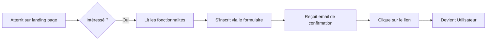
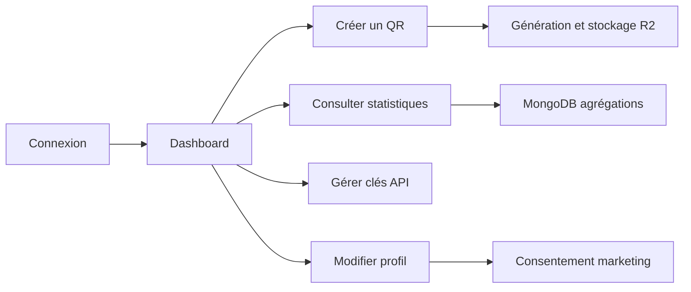
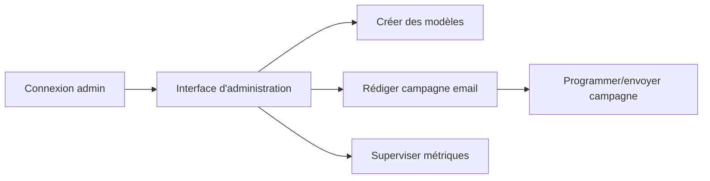
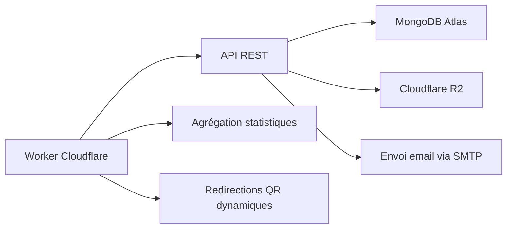
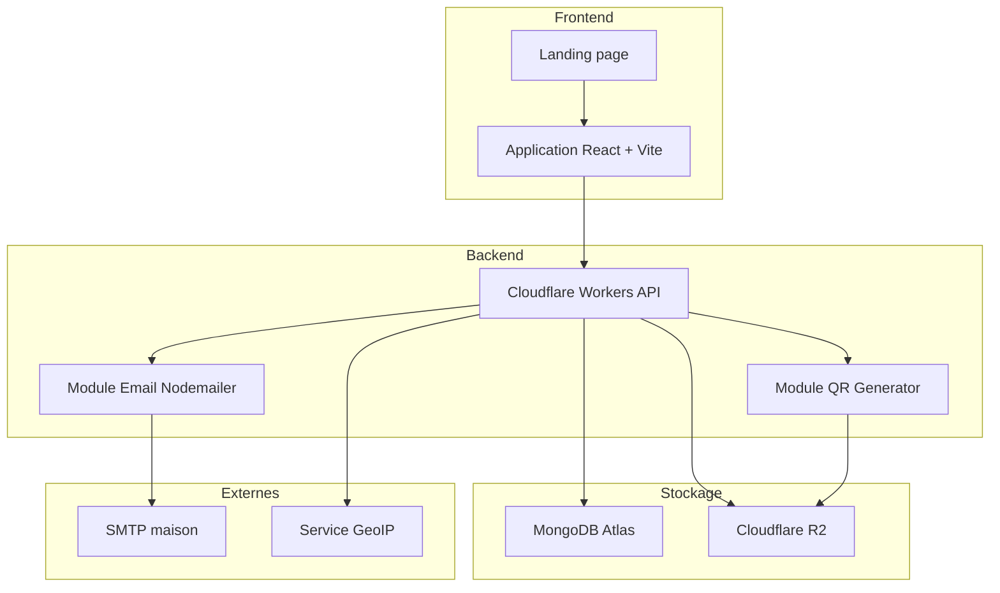

# MOT — Modèle Organisationnel de Traitements

## Contexte

Ce document définit la répartition des responsabilités, les canaux de communication et les contraintes organisationnelles pour le SaaS QR code. Il s'appuie sur les traitements définis dans le MCT.

---

## Acteurs identifiés

| Acteur | Rôle | Accès |
|--------|------|-------|
| **Visiteur** | Personne non connectée qui découvre le site. | Pages publiques, formulaire d'inscription, landing page. |
| **Utilisateur inscrit** | Personne connectée, peut créer et gérer ses QR codes. | Dashboard, éditeur QR, statistiques, clés API, profil. |
| **Administrateur** | Gère les modèles, les campagnes marketing et la modération. | Interface admin, envoi de campagnes, gestion des modèles. |
| **Système** | Processus automatisés (Workers Cloudflare, tâches planifiées). | Traitements asynchrones, envoi d'emails, agrégations. |
| **SMTP maison** | Service d'envoi d'emails géré par Nodemailer. | Envoi transactionnel et marketing. |
| **MongoDB Atlas** | Base de données hébergée. | Stockage persistant. |
| **Cloudflare R2** | Stockage objet pour les images QR. | Fichiers PNG/SVG des QR codes. |

---

## Matrice RACI

| Traitement / Activité | Visiteur | Utilisateur | Administrateur | Système |
|-----------------------|----------|-------------|----------------|---------|
| Créer un compte (T01) | R | — | — | C |
| Confirmer l'email (T02) | R | — | — | C |
| Se connecter (T03) | R | — | — | C |
| Rafraîchir access token (T16) | — | R | — | C |
| Révoquer session (T17) | — | R | — | C |
| Générer un QR code (T04) | — | R | — | C |
| Modifier un QR dynamique (T05) | — | R | — | — |
| Lister ses QR codes (T06) | — | R | — | — |
| Désactiver/supprimer un QR (T07) | — | R | — | — |
| Rediriger un QR dynamique (T08) | — | — | — | R |
| Enregistrer un scan (T09) | — | — | — | R |
| Consulter statistiques (T10) | — | R | — | C |
| Créer une campagne email (T11) | — | — | R | — |
| Envoyer une campagne email (T12) | — | — | R | R |
| Tracking email (T18) | — | — | — | R |
| Gérer les modèles (T13) | — | — | R | — |
| Gérer les clés API (T14) | — | R | — | — |
| Exporter statistiques (T15) | — | R | — | — |
| Superviser la plateforme | — | — | R | C |
| Répondre aux incidents | — | — | R | C |

**Légende :** R = Responsable (Réalise), A = Autorité (Approuve), C = Consulté, I = Informé.

---

## Flux organisationnels par acteur

### Visiteur

### Utilisateur inscrit

### Administrateur

### Système

---

## Canaux et outils par traitement

| Traitement | Canal | Outil / Service | Données échangées |
|------------|-------|-----------------|-------------------|
| T01 Inscription | Web → API → DB | React + Vite, Wrangler, MongoDB | email, mot de passe hashé |
| T02 Confirmation email | API → SMTP | Nodemailer, SMTP maison | token JWT |
| T03 Connexion | Web → API | React, Wrangler, JWT | access + refresh tokens |
| T04 Génération QR | Web → API → R2/DB | qrcode, Cloudflare R2 | image PNG/SVG, métadonnées |
| T08 Redirection | Web → API | Wrangler | aliasCourt, headers |
| T09 Enregistrement scan | API → DB | MongoDB, GeoIP | IP anonymisée, localisation |
| T10 Statistiques | API → Web | MongoDB aggregations | agrégats quotidiens |
| T12 Envoi campagne | Admin → API → SMTP | Nodemailer, queue interne | emails, tracking pixels |
| T18 Tracking email | Email client → API | Pixel 1x1 / route trackée | tokenTracking, headers |
| T13 Gérer modèles | Admin → API → DB | React admin, Wrangler, MongoDB | modèles publics/privés |

---

## Contraintes organisationnelles

| Code | Contrainte | Impact |
|------|------------|--------|
| CO01 | Un seul administrateur peut valider et envoyer une campagne email. | Sécurise la communication marketing. |
| CO02 | Le consentement marketing doit être recueilli explicitement à l'inscription. | Obligation RGPD, filtrage systématique. |
| CO03 | Les emails de confirmation et de campagne passent obligatoirement par le SMTP maison. | Contrôle des coûts et de la délivrabilité. |
| CO04 | Les scans sont anonymisés avant stockage (IP masquée). | Protection de la vie privée. |
| CO05 | Les images QR sont stockées dans un compartiment dédié et non modifiable par l'utilisateur. | Intégrité visuelle des QR statiques. |
| CO06 | Les campagnes ne peuvent être envoyées qu'aux utilisateurs actifs et consentants. | Réduction du risque de spam. |
| CO07 | Le rôle `admin` est attribué manuellement en base (pas d'auto-promotion). | Prévention des élévations de privilège. |

---

## Fréquence et volume estimés

| Traitement | Fréquence | Volume estimé (M0) |
|------------|-----------|---------------------|
| Inscription | Continue | ~100/jour au démarrage |
| Génération QR | Continue | ~500/jour |
| Scan / redirection | Continue | ~10 000/jour |
| Campagne email | Hebdomadaire | 1 à 2 campagnes/semaine |
| Agrégation statistiques | Quotidienne | 1 exécution/jour |
| Export statistiques | Ponctuel | ~50/semaine |

---

## Schéma organisationnel global

