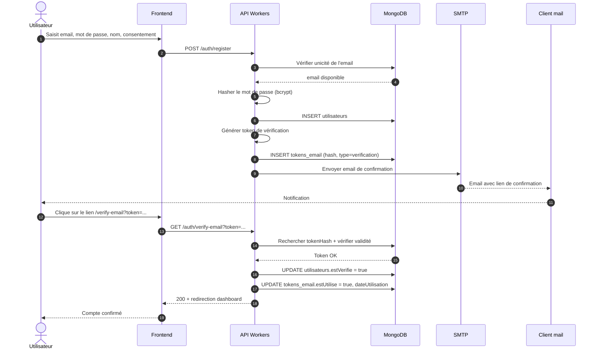
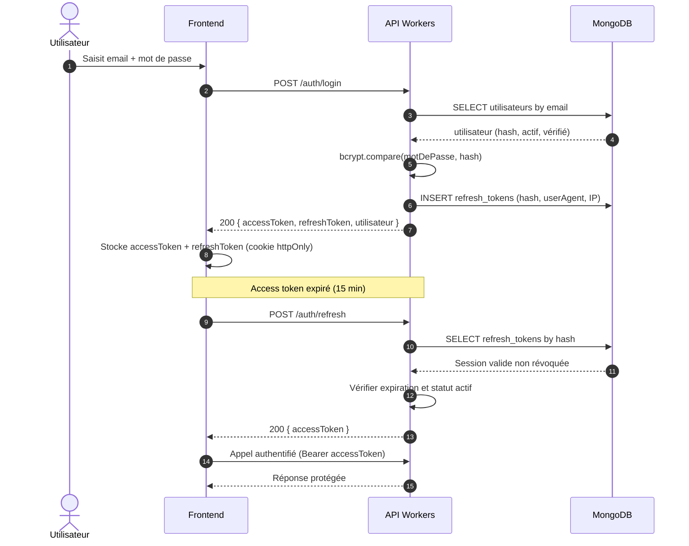
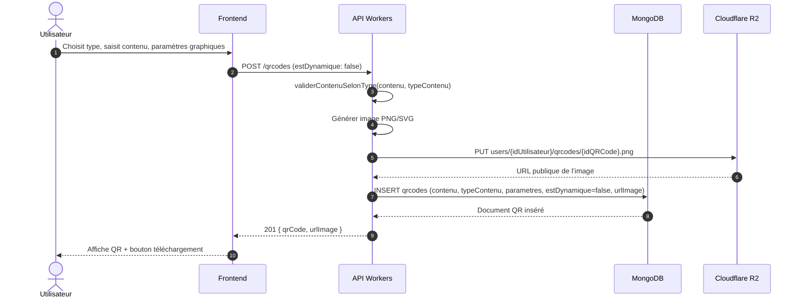
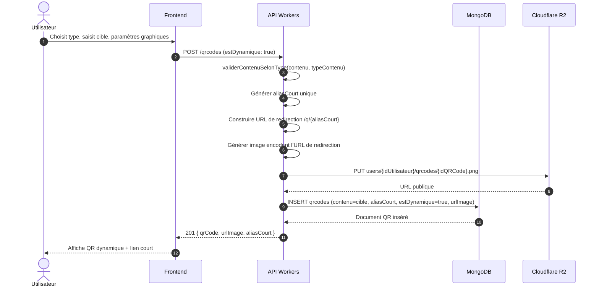
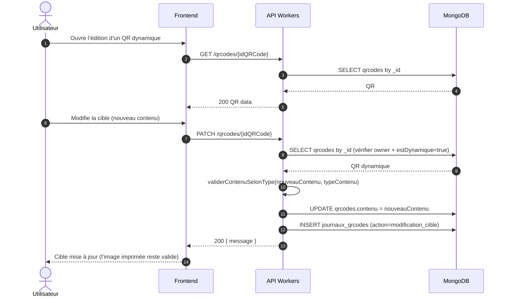
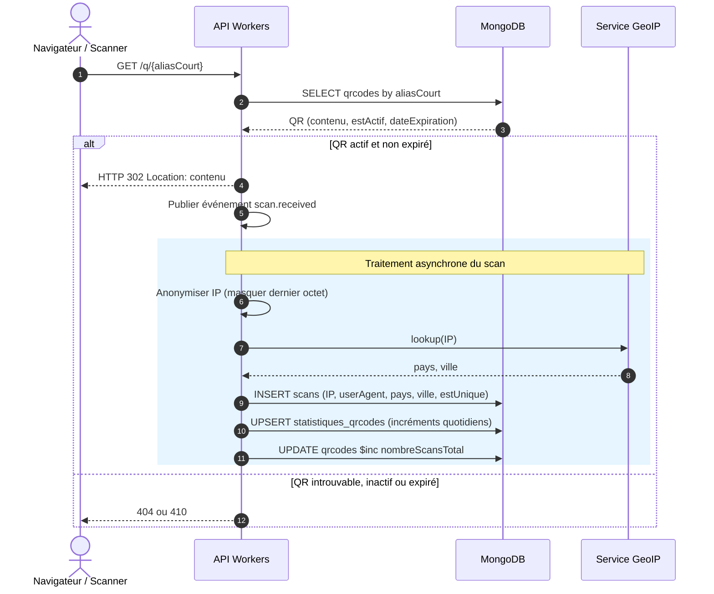
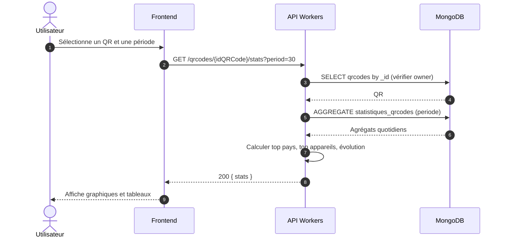
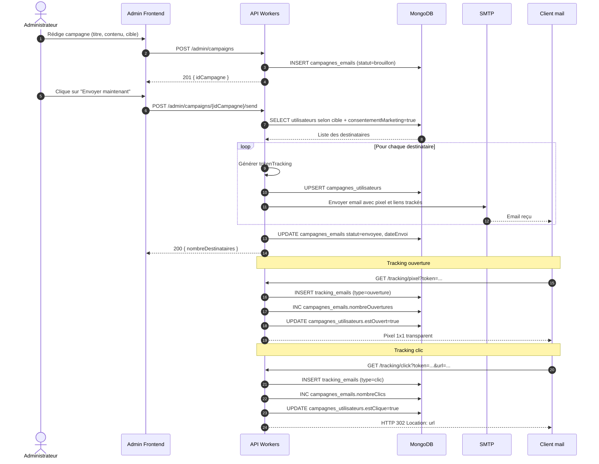
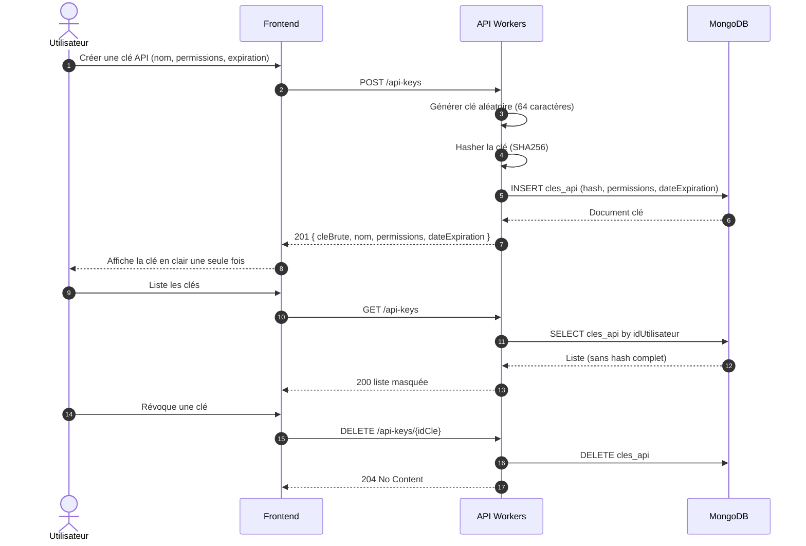
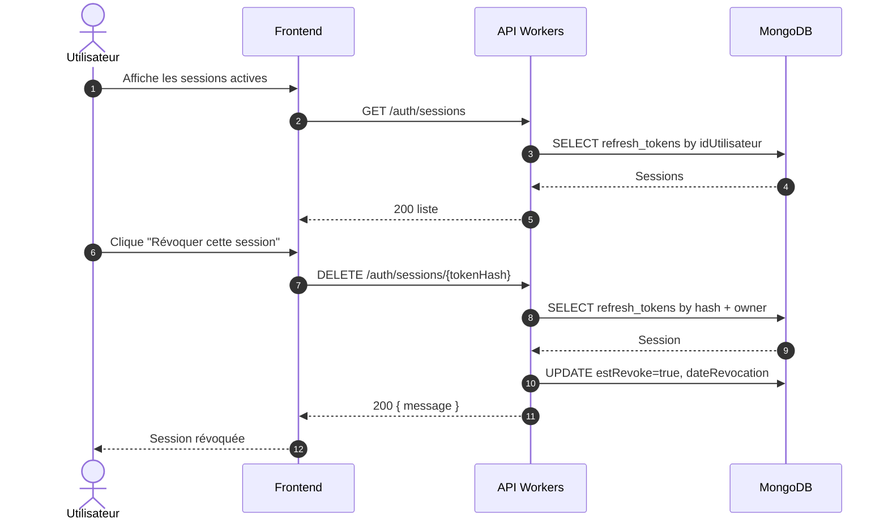

# 08 — Diagrammes de séquence Frontend / API

## Objectif

Ce document décrit les **diagrammes de séquence UML** entre le **Frontend React**, l’**API Cloudflare Workers**, la base **MongoDB**, le stockage **R2**, le serveur **SMTP** et le service **GeoIP** pour les scénarios principaux du SaaS *Free QR Code*.

Il s’appuie sur les traitements définis dans le **MCT** (`04_MCT.md`) et les pseudocodes du **MLT** (`06_MLT.md`).

---

## Participants / acteurs

| Symbole | Acteur | Rôle |
|---------|--------|------|
| `User` | Utilisateur final | Navigue sur le site et interagit avec le frontend. |
| `Admin` | Administrateur | Gère les campagnes email et les modèles. |
| `FE` | Frontend React + Vite | Interface utilisateur (landing, dashboard, éditeur QR). |
| `AdminFE` | Frontend admin React | Interface de gestion des campagnes et modèles. |
| `API` | Cloudflare Workers | API REST sécurisée (JWT, rate-limit, validations). |
| `DB` | MongoDB Atlas | Persistance des documents (utilisateurs, QR, scans, etc.). |
| `R2` | Cloudflare R2 | Stockage objet des images QR (PNG/SVG). |
| `SMTP` | Serveur SMTP maison | Envoi des emails transactionnels et marketing via Nodemailer. |
| `MailClient` | Client mail | Outlook, Gmail, etc., qui affiche les emails et charge les pixels. |
| `Scanner` | Navigateur / lecteur QR | Effectue un scan ou un GET sur un alias court dynamique. |
| `GeoIP` | Service GeoIP | Résolution pays / ville depuis une IP anonymisée. |

---

## 1. Inscription et confirmation d’email

### Diagramme de séquence



### Endpoints

| Endpoint | Méthode | Description | Payload / Paramètres |
|----------|---------|-------------|---------------------|
| `/auth/register` | `POST` | Création de compte | `{ email, motDePasse, nom, consentementMarketing }` |
| `/auth/verify-email` | `GET` | Confirmation d’email | Query `?token=<token>` |

### Payloads types

**Requête** `POST /auth/register` :
```json
{
  "email": "user@example.com",
  "motDePasse": "Str0ngP@ss!",
  "nom": "Jean Dupont",
  "consentementMarketing": true
}
```

**Réponse** `201 Created` :
```json
{
  "message": "Inscription réussie, vérifiez votre email"
}
```

---

## 2. Connexion et rafraîchissement de token

### Diagramme de séquence



### Endpoints

| Endpoint | Méthode | Description | Payload / Paramètres |
|----------|---------|-------------|---------------------|
| `/auth/login` | `POST` | Authentification | `{ email, motDePasse }` |
| `/auth/refresh` | `POST` | Renouvellement de l’access token | `{ refreshToken }` (ou cookie httpOnly) |

### Payloads types

**Requête** `POST /auth/login` :
```json
{
  "email": "user@example.com",
  "motDePasse": "Str0ngP@ss!"
}
```

**Réponse** `200 OK` :
```json
{
  "accessToken": "eyJhbGciOiJIUzI1NiIs...",
  "refreshToken": "opaque-refresh-token-xyz",
  "utilisateur": {
    "_id": "...",
    "email": "user@example.com",
    "nom": "Jean Dupont",
    "role": "utilisateur"
  }
}
```

---

## 3. Création d’un QR code statique

### Diagramme de séquence



### Endpoints

| Endpoint | Méthode | Description | Payload / Paramètres |
|----------|---------|-------------|---------------------|
| `/qrcodes` | `POST` | Créer un QR code | `{ contenu, typeContenu, parametres, estDynamique }` |

### Payloads types

**Requête** `POST /qrcodes` :
```json
{
  "contenu": "https://exemple.com",
  "typeContenu": "url",
  "estDynamique": false,
  "parametres": {
    "taille": 300,
    "couleur": "#000000",
    "correction": "M",
    "logo": null
  }
}
```

**Réponse** `201 Created` :
```json
{
  "qrCode": {
    "_id": "...",
    "contenu": "https://exemple.com",
    "typeContenu": "url",
    "estDynamique": false,
    "parametres": { "taille": 300, "couleur": "#000000", "correction": "M" },
    "nombreScansTotal": 0,
    "urlImage": "https://qr-saas-images.r2.cloudflarestorage.com/users/.../qr-xxx.png"
  }
}
```

---

## 4. Création d’un QR code dynamique

### Diagramme de séquence



### Endpoints

| Endpoint | Méthode | Description | Payload / Paramètres |
|----------|---------|-------------|---------------------|
| `/qrcodes` | `POST` | Créer un QR dynamique | `{ contenu, typeContenu, parametres, estDynamique: true }` |

### Payloads types

**Requête** `POST /qrcodes` (dynamique) :
```json
{
  "contenu": "https://promotion-ete.com",
  "typeContenu": "url",
  "estDynamique": true,
  "parametres": {
    "taille": 400,
    "couleur": "#0A2540",
    "correction": "H"
  }
}
```

**Réponse** `201 Created` :
```json
{
  "qrCode": {
    "_id": "...",
    "contenu": "https://promotion-ete.com",
    "typeContenu": "url",
    "estDynamique": true,
    "aliasCourt": "q/abc123",
    "parametres": { "taille": 400, "couleur": "#0A2540", "correction": "H" },
    "urlImage": "https://qr-saas-images.r2.cloudflarestorage.com/users/.../qr-abc123.png"
  }
}
```

---

## 5. Modification d’un QR code dynamique

### Diagramme de séquence



### Endpoints

| Endpoint | Méthode | Description | Payload / Paramètres |
|----------|---------|-------------|---------------------|
| `/qrcodes/{id}` | `GET` | Récupérer un QR | Path `id` |
| `/qrcodes/{id}` | `PATCH` | Modifier la cible d’un QR dynamique | `{ contenu }` |

### Payloads types

**Requête** `PATCH /qrcodes/{id}` :
```json
{
  "contenu": "https://promotion-hiver.com"
}
```

**Réponse** `200 OK` :
```json
{
  "message": "QR code dynamique mis à jour"
}
```

---

## 6. Redirection et enregistrement d’un scan

### Diagramme de séquence



### Endpoints

| Endpoint | Méthode | Description | Payload / Paramètres |
|----------|---------|-------------|---------------------|
| `/q/{aliasCourt}` | `GET` | Redirection d’un QR dynamique | Path `aliasCourt`, headers `User-Agent`, `Referer` |

### Détails du traitement

- L’IP est **anonymisée** avant stockage (`RG05`).
- Le scan est traité de manière **asynchrone** pour ne pas pénaliser la redirection (`T09`).
- Les statistiques sont agrégées quotidiennement via un upsert sur `statistiques_qrcodes`.

---

## 7. Consultation des statistiques d’un QR code

### Diagramme de séquence



### Endpoints

| Endpoint | Méthode | Description | Paramètres |
|----------|---------|-------------|------------|
| `/qrcodes/{id}/stats` | `GET` | Statistiques d’un QR | `?period=7` (jours) |

### Payloads types

**Réponse** `200 OK` :
```json
{
  "totalScans": 1250,
  "totalScansUniques": 980,
  "evolution": [
    { "date": "2026-07-20", "scans": 45 },
    { "date": "2026-07-21", "scans": 78 }
  ],
  "topPays": [ { "pays": "France", "count": 620 }, { "pays": "Belgique", "count": 120 } ],
  "topAppareils": [ { "appareil": "Mobile", "count": 800 }, { "appareil": "Desktop", "count": 450 } ]
}
```

---

## 8. Envoi de campagne email et tracking

### Diagramme de séquence



### Endpoints

| Endpoint | Méthode | Description | Payload / Paramètres |
|----------|---------|-------------|---------------------|
| `/admin/campaigns` | `POST` | Créer une campagne | `{ titre, contenu, cible }` |
| `/admin/campaigns/{id}/send` | `POST` | Envoyer la campagne | Path `id` |
| `/tracking/pixel` | `GET` | Pixel d’ouverture | `?token=...` |
| `/tracking/click` | `GET` | Lien tracé | `?token=...&url=...` |

### Payloads types

**Requête** `POST /admin/campaigns` :
```json
{
  "titre": "Nouveautés QR Code",
  "contenu": "<html>...</html>",
  "cible": "actifs"
}
```

**Réponse** `POST /admin/campaigns/{id}/send` :
```json
{
  "nombreDestinataires": 1542
}
```

---

## 9. Gestion des clés API

### Diagramme de séquence



### Endpoints

| Endpoint | Méthode | Description | Payload / Paramètres |
|----------|---------|-------------|---------------------|
| `/api-keys` | `POST` | Créer une clé API | `{ nom, permissions, dateExpiration }` |
| `/api-keys` | `GET` | Lister les clés | — |
| `/api-keys/{id}` | `DELETE` | Révoquer une clé | Path `id` |

### Payloads types

**Requête** `POST /api-keys` :
```json
{
  "nom": "Intégration site",
  "permissions": ["qrcodes:read", "qrcodes:create"],
  "dateExpiration": "2027-01-01T00:00:00Z"
}
```

**Réponse** `201 Created` :
```json
{
  "cleBrute": "qr_live_abc123...xyz",
  "nom": "Intégration site",
  "permissions": ["qrcodes:read", "qrcodes:create"],
  "dateExpiration": "2027-01-01T00:00:00Z"
}
```

---

## 10. Révocation de session

### Diagramme de séquence



### Endpoints

| Endpoint | Méthode | Description | Payload / Paramètres |
|----------|---------|-------------|---------------------|
| `/auth/sessions` | `GET` | Lister les sessions actives | — |
| `/auth/sessions/{tokenHash}` | `DELETE` | Révoquer une session | Path `tokenHash` |

### Payloads types

**Réponse** `DELETE /auth/sessions/{tokenHash}` :
```json
{
  "message": "Session révoquée"
}
```

---

## Tableau récapitulatif des endpoints

| Ressource | Endpoint | Méthode | Description |
|-----------|----------|---------|-------------|
| Authentification | `/auth/register` | `POST` | Inscription |
| Authentification | `/auth/verify-email` | `GET` | Confirmation email |
| Authentification | `/auth/login` | `POST` | Connexion |
| Authentification | `/auth/refresh` | `POST` | Rafraîchir l’access token |
| Authentification | `/auth/sessions` | `GET` | Lister les sessions |
| Authentification | `/auth/sessions/{tokenHash}` | `DELETE` | Révoquer une session |
| QR Code | `/qrcodes` | `POST` | Créer un QR (statique ou dynamique) |
| QR Code | `/qrcodes/{id}` | `GET` | Récupérer un QR |
| QR Code | `/qrcodes/{id}` | `PATCH` | Modifier un QR dynamique |
| QR Code | `/qrcodes/{id}/stats` | `GET` | Statistiques d’un QR |
| Redirection | `/q/{aliasCourt}` | `GET` | Redirection d’un QR dynamique |
| Tracking | `/tracking/pixel` | `GET` | Pixel d’ouverture d’email |
| Tracking | `/tracking/click` | `GET` | Clic tracé sur un email |
| Admin | `/admin/campaigns` | `POST` | Créer une campagne email |
| Admin | `/admin/campaigns/{id}/send` | `POST` | Envoyer une campagne email |
| API Keys | `/api-keys` | `POST` | Créer une clé API |
| API Keys | `/api-keys` | `GET` | Lister les clés API |
| API Keys | `/api-keys/{id}` | `DELETE` | Révoquer une clé API |

---

## Notes de cohérence

- Les noms de collections MongoDB utilisées sont : `utilisateurs`, `tokens_email`, `refresh_tokens`, `qrcodes`, `journaux_qrcodes`, `scans`, `statistiques_qrcodes`, `campagnes_emails`, `campagnes_utilisateurs`, `tracking_emails`, `cles_api`.
- Les URLs des endpoints sont indicatives ; elles doivent être alignées avec la spécification OpenAPI finale du projet.
- Les mots de passe et les clés API sont stockés sous forme de hash ; les tokens de refresh sont également stockés hashés.
