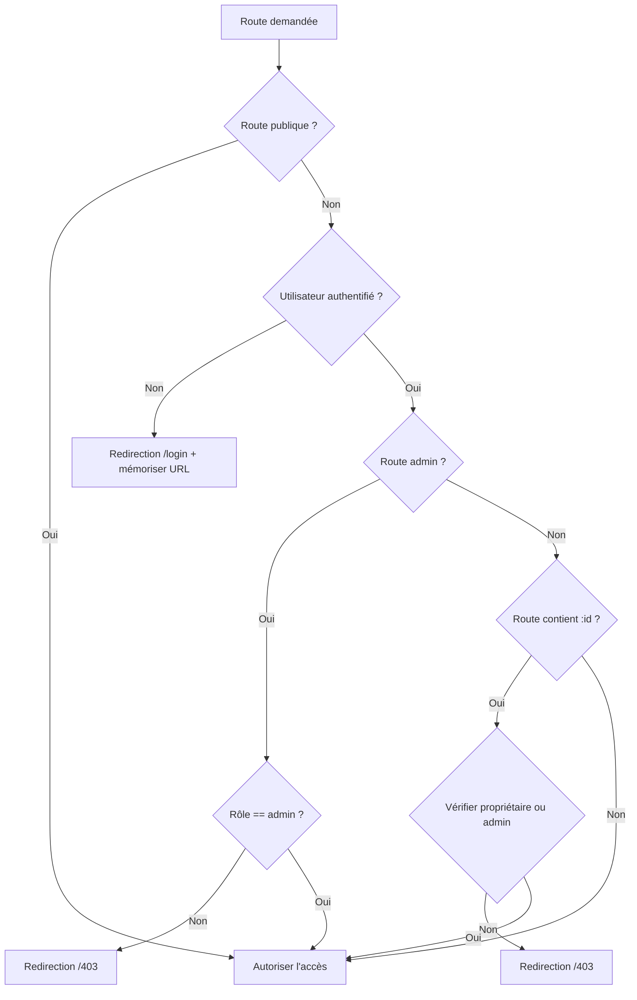
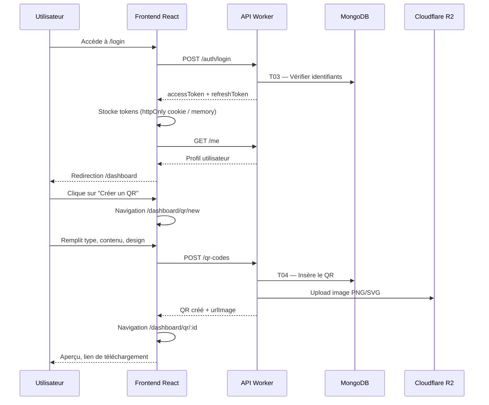

# UML Frontend Navigation — Navigation applicative du SaaS QR Code

## Contexte

Ce document décrit la structure de navigation du frontend de l'application **Free QR Code SaaS**. Il identifie les écrans, les flux par persona, les menus, les règles de routage (publiques vs protégées) ainsi que la correspondance avec les traitements métier définis dans le MCT.

Stack cible : **React + Vite** ; backend **Cloudflare Workers** ; authentification par JWT access token (15 min) et refresh token (7 jours).

---

## Schéma de navigation global

```mermaid
flowchart TD
    subgraph Public
        A1[/ /] --> A2[/ /login]
        A1 --> A3[/ /register]
        A2 --> A3
        A3 --> A2
        A1 --> A4[/ /features]
        A1 --> A5[/ /pricing]
        A1 --> A6[/ /legal/privacy]
        A1 --> A7[/ /legal/terms]
        A8[/ /q/:aliasCourt] --> B1[Redirection backend]
    end

    subgraph Authentification
        A2
        A3
        C1[/ /verify-email/:token]
        C2[/ /forgot-password]
        C3[/ /reset-password/:token]
    end

    subgraph UtilisateurConnecte
        D1[/dashboard] --> D2[/dashboard/qr/new]
        D1 --> D3[/dashboard/qr]
        D3 --> D4[/dashboard/qr/:id]
        D4 --> D5[/dashboard/qr/:id/edit]
        D4 --> D6[/dashboard/qr/:id/stats]
        D6 --> D7[/dashboard/qr/:id/export]
        D1 --> D8[/dashboard/templates]
        D1 --> D9[/dashboard/api-keys]
        D1 --> D10[/dashboard/settings]
        D10 --> D11[/dashboard/settings/sessions]
    end

    subgraph Administration
        E1[/admin] --> E2[/admin/campaigns]
        E2 --> E3[/admin/campaigns/new]
        E2 --> E4[/admin/campaigns/:id]
        E1 --> E5[/admin/templates]
        E1 --> E6[/admin/users]
        E1 --> E7[/admin/metrics]
    end

    subgraph Erreurs
        F1[/ /404]
        F2[/ /401]
        F3[/ /403]
        F4[/ /500]
    end

    A1 -.->|CTA Connexion| A2
    A1 -.->|CTA Inscription| A3
    A3 -->|email envoyé| C1
    A2 -->|mot de passe oublié| C2
    C2 --> C3
    C1 --> D1
    A2 --> D1
```

---

## Flux utilisateur par persona

### Visiteur (non connecté)

| Étape | Page / Route | Objectif | Règles |
|-------|--------------|----------|--------|
| 1 | `/` | Découvrir le service, lire les arguments marketing | Publique |
| 2 | `/features` | Consulter les fonctionnalités détaillées | Publique |
| 3 | `/pricing` | Voir les offres (même si le service est gratuit, page de transparence) | Publique |
| 4 | `/register` | Créer un compte | Publique, redirige vers `/dashboard` si déjà connecté |
| 5 | `/login` | Se connecter | Publique, redirige vers `/dashboard` si déjà connecté |
| 6 | `/q/:aliasCourt` | Scanneur externe redirigé vers la cible finale | Publique, backend (T08) |

Le visiteur ne peut pas générer de QR code. L'inscription est obligatoire (RG01).

### Utilisateur connecté

| Étape | Page / Route | Objectif | Traitements liés |
|-------|--------------|----------|------------------|
| 1 | `/login` → `/dashboard` | Authentification | T03, T16 |
| 2 | `/dashboard` | Vue d'ensemble : QR récents, scans du jour, accès rapide | T06 |
| 3 | `/dashboard/qr/new` | Créer un QR code (statique ou dynamique) | T04 |
| 4 | `/dashboard/qr` | Lister, rechercher, filtrer ses QR codes | T06 |
| 5 | `/dashboard/qr/:id` | Voir le détail d'un QR (aperçu, lien image, type) | T06 |
| 6 | `/dashboard/qr/:id/edit` | Modifier la cible d'un QR dynamique | T05 |
| 7 | `/dashboard/qr/:id/stats` | Consulter les statistiques détaillées | T10 |
| 8 | `/dashboard/qr/:id/export` | Exporter les statistiques (CSV/JSON/XLSX) | T15 |
| 9 | `/dashboard/templates` | Parcourir les modèles publics | T06, T13 (lecture) |
| 10 | `/dashboard/api-keys` | Créer, lister, révoquer des clés API | T14 |
| 11 | `/dashboard/settings` | Modifier le profil, le consentement marketing, le mot de passe | T17 |
| 12 | `/dashboard/settings/sessions` | Voir et révoquer les sessions actives | T17 |

### Administrateur

L'administrateur hérite de tous les flux utilisateur connecté, avec des pages supplémentaires.

| Étape | Page / Route | Objectif | Traitements liés |
|-------|--------------|----------|------------------|
| 1 | `/admin` | Tableau de bord administrateur : KPI globaux | — |
| 2 | `/admin/campaigns` | Lister les campagnes email | T11, T12 |
| 3 | `/admin/campaigns/new` | Rédiger une nouvelle campagne | T11 |
| 4 | `/admin/campaigns/:id` | Voir le détail, les stats d'ouverture/clics | T18 |
| 5 | `/admin/templates` | Créer/modifier les modèles publics de QR | T13 |
| 6 | `/admin/users` | Rechercher, consulter, désactiver un compte | T07 (compte) |
| 7 | `/admin/metrics` | Superviser volumes, scans, emails | T09, T12 |

---

## Structure des menus

### Menu principal (landing / header)

Visible sur toutes les pages publiques. S'adapte à l'état de connexion.

```
Free QR Code SaaS
├── Fonctionnalités  → /features
├── Tarifs           → /pricing
├── Documentation    → /docs (externe)
├── Se connecter     → /login    (visiteur)
└── S'inscrire       → /register (visiteur)

Version connectée :
Free QR Code SaaS
├── Dashboard        → /dashboard
├── Mes QR codes     → /dashboard/qr
├── Modèles          → /dashboard/templates
└── Mon compte       → /dashboard/settings
```

### Menu dashboard (utilisateur connecté)

Sidebar ou navigation latérale après connexion.

```
Dashboard
├── Vue d'ensemble        → /dashboard
├── Mes QR codes
│   ├── Liste             → /dashboard/qr
│   ├── Créer un QR       → /dashboard/qr/new
│   └── Modèles publics   → /dashboard/templates
├── Statistiques globales → /dashboard/stats (optionnel)
├── Clés API              → /dashboard/api-keys
├── Paramètres
│   ├── Profil            → /dashboard/settings
│   ├── Sessions          → /dashboard/settings/sessions
│   └── Mot de passe      → /dashboard/settings/security
└── Déconnexion           → action T17 + redirection /login
```

### Menu administration

Visible uniquement pour les utilisateurs avec `role = admin`.

```
Administration
├── Vue d'ensemble   → /admin
├── Campagnes email
│   ├── Liste        → /admin/campaigns
│   ├── Nouvelle     → /admin/campaigns/new
│   └── Détail       → /admin/campaigns/:id
├── Modèles QR       → /admin/templates
├── Utilisateurs     → /admin/users
└── Métriques        → /admin/metrics
```

---

## Routes publiques et protégées

### Routes publiques

| Route | Description | Comportement si connecté |
|-------|-------------|--------------------------|
| `/` | Landing page | Affiché normalement (CTA adaptés) |
| `/features` | Fonctionnalités | Affiché normalement |
| `/pricing` | Tarification | Affiché normalement |
| `/login` | Connexion | Redirection vers `/dashboard` |
| `/register` | Inscription | Redirection vers `/dashboard` |
| `/verify-email/:token` | Confirmation d'email | Redirection vers `/dashboard` si vérifié |
| `/forgot-password` | Demande de réinitialisation | Affiché |
| `/reset-password/:token` | Réinitialisation du mot de passe | Affiché |
| `/legal/privacy` | Politique de confidentialité | Affiché |
| `/legal/terms` | Conditions d'utilisation | Affiché |
| `/q/:aliasCourt` | Redirection d'un QR dynamique | Traitée par le backend (T08) |

### Routes protégées (authentification requise)

| Route | Rôle minimum | Description |
|-------|--------------|-------------|
| `/dashboard` | utilisateur | Tableau de bord personnel |
| `/dashboard/qr` | utilisateur | Liste des QR codes |
| `/dashboard/qr/new` | utilisateur | Création de QR code |
| `/dashboard/qr/:id` | utilisateur (propriétaire) | Détail d'un QR code |
| `/dashboard/qr/:id/edit` | utilisateur (propriétaire, QR dynamique) | Modification cible |
| `/dashboard/qr/:id/stats` | utilisateur (propriétaire) | Statistiques |
| `/dashboard/qr/:id/export` | utilisateur (propriétaire) | Export stats |
| `/dashboard/templates` | utilisateur | Galerie de modèles |
| `/dashboard/api-keys` | utilisateur | Gestion des clés API |
| `/dashboard/settings/*` | utilisateur | Paramètres du compte |

### Routes réservées aux administrateurs

| Route | Rôle requis | Description |
|-------|-------------|-------------|
| `/admin` | admin | Dashboard admin |
| `/admin/campaigns` | admin | Campagnes email |
| `/admin/campaigns/new` | admin | Création de campagne |
| `/admin/campaigns/:id` | admin | Détail campagne |
| `/admin/templates` | admin | Gestion des modèles |
| `/admin/users` | admin | Gestion utilisateurs |
| `/admin/metrics` | admin | Métriques opérationnelles |

### Logique de garde (route guards)



---

## États d'erreur et accessibilité

### Pages d'erreur dédiées

| Code | Route | Contexte d'affichage | Contenu attendu |
|------|-------|------------------------|-----------------|
| 404 | `/404` | Route inconnue ou ressource inexistante | Message clair, lien vers `/` et `/dashboard` |
| 401 | `/401` | Utilisateur non authentifié sur une ressource protégée | Invitation à se connecter, bouton `/login` |
| 403 | `/403` | Utilisateur authentifié mais sans autorisation | Explication du rôle insuffisant, contact support |
| 500 | `/500` | Erreur serveur inattendue | Message générique, bouton retour |
| 410 | `/410` | QR dynamique expiré | Message "Ce QR code a expiré" (T08) |

### Comportements accessibilité (a11y)

| Exigence | Implémentation frontend |
|----------|-------------------------|
| Navigation clavier | Tous les menus, boutons et liens sont focusables ; ordre de tabulation logique. |
| Lecteurs d'écran | `aria-label` sur les icônes, `aria-current="page"` sur l'item actif, titres de page uniques par route. |
| Messages d'erreur | Rôles `alert` / `status`, association explicite `aria-describedby` avec les champs de formulaire. |
| Chargement | États `aria-busy="true"` et skeletons pendant les appels API. |
| Contraste | Respect des ratios WCAG 2.1 AA sur les éléments interactifs. |
| Redirections | Annonce vocale du changement de page via un live region caché. |

### États fonctionnels des pages

| État | Description | Exemple |
|------|-------------|---------|
| Vide | Aucune donnée à afficher | Liste de QR vide après première connexion. |
| Chargement | Données en cours de récupération | Skeleton sur `/dashboard/qr`. |
| Erreur réseau | Échec de l'API | Message retry, log console. |
| Non autorisé | 403 métier | Tentative d'accès à un QR d'un autre utilisateur. |
| Formulaire invalide | Erreurs de validation | Inscription : email déjà utilisé, mot de passe faible. |

---

## Table de correspondance routes ↔ traitements MCT

| Page / Route | Acteur | Traitement MCT | Opérations frontend clés |
|--------------|--------|----------------|--------------------------|
| `/register` | Visiteur | **T01 — S'inscrire** | Formulaire, validation client, appel API, message de confirmation. |
| `/verify-email/:token` | Utilisateur | **T02 — Confirmer son email** | Appel API avec le token, redirection dashboard ou message d'erreur. |
| `/login` | Utilisateur | **T03 — Se connecter** | Authentification, stockage des tokens, redirection post-connexion. |
| `/dashboard` | Utilisateur | **T06 — Lister ses QR codes** | Récupération paginée des QR récents, KPI rapides. |
| `/dashboard/qr/new` | Utilisateur | **T04 — Générer un QR code** | Wizard de création : type, contenu, paramètres, prévisualisation. |
| `/dashboard/qr/:id/edit` | Utilisateur | **T05 — Modifier un QR code dynamique** | Formulaire de modification de cible, confirmation, journal. |
| `/dashboard/qr` | Utilisateur | **T06 — Lister ses QR codes** | Tableau avec filtres, recherche, pagination, actions rapides. |
| `/dashboard/qr/:id` | Utilisateur | **T06 — Lister / T07 — Désactiver/supprimer** | Détail, aperçu, désactivation, suppression. |
| `/q/:aliasCourt` | Système | **T08 — Rediriger un QR dynamique** | Pas de page React : redirection HTTP gérée par le Worker. |
| `/q/:aliasCourt` (scan) | Système | **T09 — Enregistrer un scan** | Appel asynchrone côté backend après redirection. |
| `/dashboard/qr/:id/stats` | Utilisateur | **T10 — Consulter les statistiques** | Graphiques (courbe, camembert), filtres de période. |
| `/admin/campaigns/new` | Administrateur | **T11 — Créer une campagne email** | Éditeur de campagne, validation du lien de désinscription. |
| `/admin/campaigns/:id/send` | Système | **T12 — Programmer / envoyer une campagne** | Bouton d'envoi, programmation horaire. |
| `/admin/campaigns/:id` | Administrateur | **T18 — Consulter les métriques de tracking email** | Affichage des métriques d'ouverture et de clic. |
| `/admin/templates` | Administrateur | **T13 — Gérer les modèles de QR** | CRUD modèles, visibilité publique/privée. |
| `/dashboard/api-keys` | Utilisateur | **T14 — Gérer les clés API** | Création, affichage unique, révocation, copie sécurisée. |
| `/login` (refresh silencieux) | Utilisateur | **T16 — Rafraîchir un access token** | Intercepteur 401, appel `/refresh`, retry requête. |
| `/dashboard/settings/sessions` | Utilisateur | **T17 — Révoquer une session** | Liste des sessions, bouton révoquer. |
| `/admin/campaigns/:id` | Système | **T18 — Enregistrer un événement de tracking email** | Affichage des métriques d'ouverture et de clic. |

---

## Diagramme de séquence : connexion puis création d'un QR



---

## Règles de routage complémentaires

1. **Route racine `/`** : Landing page avec appel à l'action vers `/register`. Si l'utilisateur est connecté, le CTA principal devient "Aller au tableau de bord".
2. **Préfixe `/dashboard`** : Nécessite impérativement un access token valide. Chaque sous-route hérite de cette garde.
3. **Préfixe `/admin`** : Nécessite le rôle `admin`. Un utilisateur standard connecté obtient une page `/403`.
4. **Paramètres de requête** : Les pages de liste supportent `?page=`, `?type=`, `?status=`, `?search=` pour permettre le partage et le retour arrière du navigateur.
5. **Routes de ressources** : `/dashboard/qr/:id` accepte un identifiant MongoDB (`ObjectId`) ou un alias court selon l'implémentation backend.
6. **Redirection post-authentification** : Après connexion, l'utilisateur est redirigé vers l'URL mémorisée (ex: `/dashboard/qr/xxx/stats`) ou vers `/dashboard` par défaut.
7. **Déconnexion** : Suppression des tokens côté client, appel `POST /auth/logout` (révocation du refresh token courant), redirection vers `/`.

---

## Glossaire

| Terme | Définition |
|-------|------------|
| **Route publique** | Page accessible sans authentification. |
| **Route protégée** | Page nécessitant un token d'accès valide. |
| **Route admin** | Page protégée et réservée au rôle `admin`. |
| **Route guard** | Mécanisme de contrôle d'accès avant le rendu d'une page. |
| **Persona** | Profil d'utilisateur représentatif (visiteur, utilisateur, admin). |
| **CTA** | *Call To Action* : bouton ou lien incitant à une action. |
| **a11y** | Abréviation pour *accessibility* (accessibilité). |
| **Skeleton** | Composant de chargement visuel structuré. |

---

## Hypothèses et évolutions futures

1. **Internationalisation** : les routes restent identiques ; la langue est portée par les préférences utilisateur ou un paramètre `?lang=`.
2. **PWA** : les routes statiques (`/`, `/features`, `/pricing`) pourront être pré-rendues pour le SEO.
3. **Partage social** : une route `/s/:aliasCourt` pourrait être ajoutée pour afficher une page intermédiaire de prévisualisation avant redirection.
4. **Analytics frontend** : les événements de navigation seront traqués de manière anonyme (conformément à la politique RGPD).
