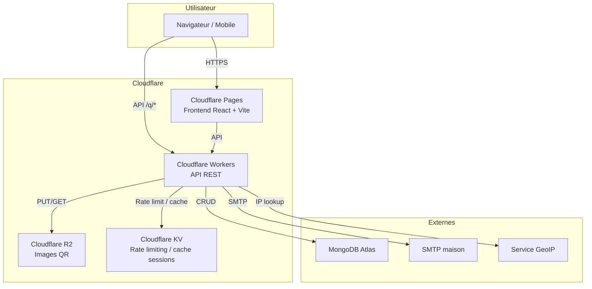
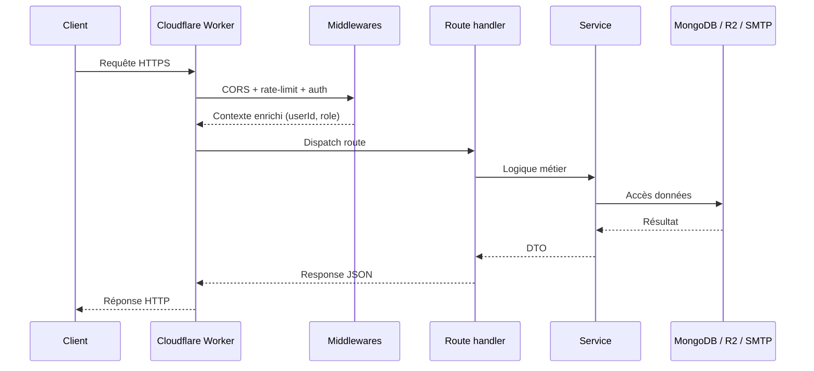
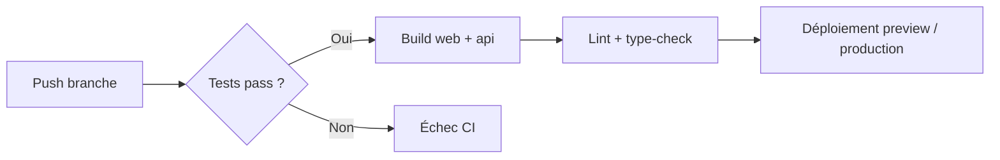

# Architecture technique

## Vue d'ensemble

Ce document décrit l'architecture technique du SaaS *Free QR Code* : stack, déploiement, sécurité, flux de données et choix d'infrastructure. Il s'appuie sur le MPD (`03_MPD.md`), le MOT (`05_MOT.md`) et les diagrammes de séquence (`08_UML_FRONTEND_SEQUENCES.md`).

---

## Stack globale

| Couche | Technologie | Justification |
|--------|-------------|---------------|
| Frontend | React + Vite + TypeScript | Build rapide, SSR possible, écosystème riche. |
| Mobile | Expo (optionnel, phase 2) | Partage de code React avec le web si besoin. |
| Backend API | Cloudflare Workers (Hono ou Itty Router) | Edge deployment, faible latence, coût maîtrisé. |
| Base de données | MongoDB Atlas M0 | Document natif, gratuit au démarrage, schéma souple. |
| Stockage fichiers | Cloudflare R2 | Compatible S3, pas de frais de sortie, images QR. |
| Envoi d'emails | SMTP maison via Nodemailer | Contrôle total, pas de SaaS email tiers. |
| Géolocalisation IP | Service GeoIP auto-hébergé ou ipapi.co | Localisation anonymisée des scans. |
| Génération QR | qrcode (Node.js) ou côté client (qrcode.react) | Flexibilité statique/dynamique. |
| Authentification | JWT access token + refresh token (httpOnly cookie) | Stateless, rotation possible. |
| Hébergement frontend | Cloudflare Pages | Intégration native avec Workers et R2. |
| CI/CD | GitHub Actions | Tests, build, déploiement automatique. |
| Monitoring | Cloudflare Analytics + Sentry (optionnel) | Logs edge et erreurs applicatives. |

---

## Schéma d'architecture



---

## Structure des projets

```text
free-qr-code/
├── apps/
│   ├── web/                    # React + Vite + TypeScript
│   │   ├── src/
│   │   │   ├── components/
│   │   │   ├── pages/
│   │   │   ├── hooks/
│   │   │   ├── services/
│   │   │   ├── stores/
│   │   │   └── types/
│   │   ├── package.json
│   │   └── vite.config.ts
│   └── api/                    # Cloudflare Workers + Hono
│       ├── src/
│       │   ├── routes/
│       │   ├── middlewares/
│       │   ├── services/
│       │   ├── models/
│       │   ├── lib/
│       │   └── index.ts
│       ├── wrangler.toml
│       └── package.json
├── packages/
│   ├── shared-types/           # Types partagés entre web et api
│   └── ui/                     # Composants UI partagés (optionnel)
├── scripts/
│   └── init-db.js              # Script de création MongoDB
├── merise/                     # Documentation MERISE / UML
├── docs/
│   └── openapi.yaml            # Spécification API (futur)
└── package.json                # Workspace npm / pnpm
```

---

## Architecture backend (Workers)

### Router

```text
/index.ts
  ├── middlewares/
  │   ├── cors.ts
  │   ├── auth.ts           # Vérification JWT access token
  │   ├── rate-limit.ts     # Rate limiting par IP / compte
  │   └── error-handler.ts
  ├── routes/
  │   ├── auth.ts           # /auth/register, /login, /refresh, /logout, /sessions
  │   ├── qr.ts             # /qrcodes, /q/:aliasCourt
  │   ├── stats.ts          # /qrcodes/:id/stats, /export
  │   ├── admin.ts          # /admin/campaigns, /admin/templates
  │   ├── tracking.ts       # /tracking/pixel, /tracking/click
  │   └── api-keys.ts       # /api-keys
  └── services/
      ├── db.ts             # Connexion MongoDB
      ├── r2.ts             # Client R2
      ├── email.ts          # Nodemailer SMTP
      ├── qr-generator.ts # Génération image QR
      └── geoip.ts          # Résolution IP
```

### Cycle de vie d'une requête



---

## Architecture frontend (React)

### Structure des dossiers

```text
apps/web/src/
├── components/           # Composants réutilisables
├── pages/                # Écrans correspondant aux routes
├── hooks/                # Hooks personnalisés (auth, fetch, forms)
├── services/             # Appels API (axios/fetch wrapper)
├── stores/               # État global (Zustand ou Context)
├── types/                # Types TypeScript
├── utils/                # Helpers (dates, validation, format)
└── routes.tsx            # Définition des routes (React Router)
```

### Gestion de l'état

| État | Solution | Justification |
|------|----------|---------------|
| Auth | Context + hook `useAuth` | Access token en mémoire, refresh token en httpOnly cookie. |
| Données métier | React Query / SWR | Cache, revalidation, états de chargement. |
| UI locale | Zustand ou useState | Toasts, modales, filtres de liste. |

### Routage

- React Router v6.
- Route guards pour `/dashboard/*` et `/admin/*`.
- Intercepteur 401 → refresh silencieux → retry ou redirection `/login`.

---

## Sécurité

### Authentification

- **Mots de passe** : bcrypt avec coût ≥ 12.
- **JWT access token** : durée 15 minutes, signé HS256 ou RS256, contient `userId`, `role`, `jti`.
- **Refresh token** : durée 7 jours, stocké hashé en base, révocable par l'utilisateur.
- **Cookies** : `httpOnly`, `Secure`, `SameSite=Lax` (voire `Strict` pour refresh).
- **Révocation** : endpoint `DELETE /auth/sessions/:tokenHash`.

### Autorisation

- Middleware `requireAuth` pour toutes les routes protégées.
- Middleware `requireAdmin` pour les routes `/admin/*`.
- Vérification propriétaire sur les ressources QR (`idUtilisateur`).

### Données

- Validation stricte des entrées avec Zod sur toutes les routes.
- Sanitisation des URLs de redirection pour éviter les open redirects.
- Anonymisation des IPs avant stockage (masquage des 8 derniers bits IPv4).
- RGPD : consentement marketing explicite, droit à l'effacement, export données.

### Réseau

- HTTPS uniquement (Cloudflare gère le certificat).
- CORS restreint aux domaines autorisés (`*.free-qrcode.app`, `localhost:5173`).
- Rate limiting : 100 req/min par IP, 1000 req/min par compte authentifié.
- CSP headers sur le frontend.

### Stockage

- Mots de passe et clés API hashés.
- Tokens email stockés hashés.
- R2 : bucket dédié, politique d'accès restrictive, URLs signées si besoin.

---

## Déploiement

### Environnements

| Environnement | Branche | Frontend | API | Base |
|---------------|---------|----------|-----|------|
| Production | `main` | Cloudflare Pages production | Workers production | MongoDB Atlas production |
| Staging | `develop` | Cloudflare Pages preview | Workers preview | MongoDB Atlas staging |
| Local | feature/* | Vite dev server | Wrangler dev | MongoDB local / Docker |

### Pipeline CI/CD



### Secrets / variables

Gérés via `wrangler secret` et variables d'environnement GitHub :

- `MONGODB_URI`
- `JWT_ACCESS_SECRET`
- `JWT_REFRESH_SECRET`
- `R2_ACCESS_KEY_ID`, `R2_SECRET_ACCESS_KEY`, `R2_BUCKET_NAME`, `R2_ENDPOINT`
- `SMTP_HOST`, `SMTP_PORT`, `SMTP_USER`, `SMTP_PASS`
- `GEOIP_API_KEY` (si service payant)

---

## Performance et scalabilité

| Cible | Moyen |
|-------|-------|
| Temps de génération QR | < 500 ms ( Worker edge + cache R2) |
| Redirection scan | < 100 ms ( Worker edge + MongoDB index aliasCourt) |
| Assets statiques | Cache Cloudflare CDN + R2 |
| Agrégations stats | Worker cron quotidien (`wrangler cron`) |
| Rate limiting | KV avec expiration courte |

---

## Contraintes et hypothèses

1. **Workers stateless** : pas de sessions mémoire, tout passe par JWT/MongoDB.
2. **MongoDB M0** : limite de 512 Mo, prévoir migration M10 si croissance.
3. **SMTP maison** : nécessite un serveur mail avec SPF/DKIM/DMARC configurés.
4. **R2** : pas de fichiers sensibles, uniquement des images QR publiques ou privées par URL signée.
5. **GeoIP** : service tiers ou base locale ; IP anonymisée avant persistence.
6. **Pas de WebSocket** : polling ou Server-Sent Events (SSE) si besoin de temps réel plus tard.

---

## Évolutions possibles

- Workers cron pour l'envoi de campagnes programmées.
- Queue Cloudflare (ou service externe) pour l'envoi massif d'emails.
- API publique clé API pour créer des QR via un tiers.
- PWA + pré-rendu de certaines landing pages pour le SEO.
- Multi-langue via i18n.
